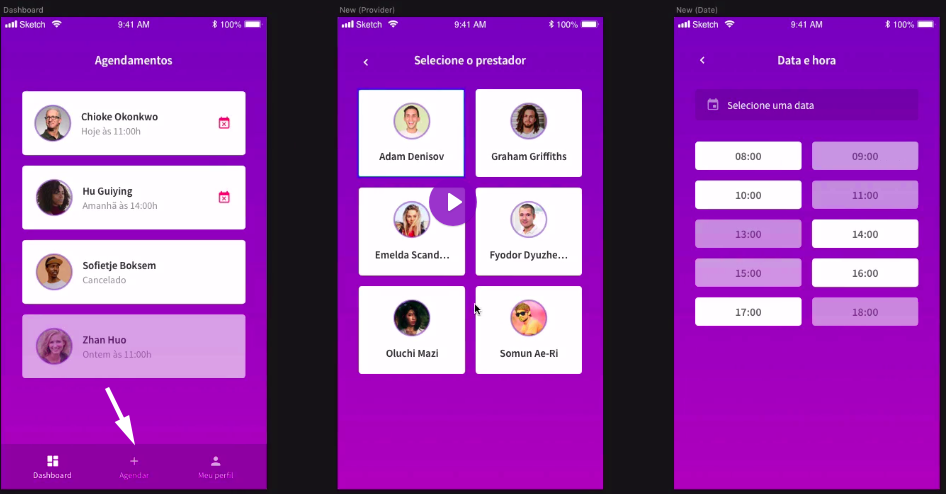

# About

Welcome! This is **GoBarber - Clients App**!

Basically it is an application made with React Native with several features and resources. GoBarber - Clients App is consuming [GoBarber API](https://github.com/rodrigotamura/go-stack-2019/tree/master/module02), made with Express Framework.

# Configuring root import

Every time we want to call some file in our scripts, like:

```javascript
import SignIn from '../pages/Signin';
import SignUp from '../pages/Signup';

import Dashboard from '../pages/Dashboard';
import Profile from '../pages/Profile';
```

We must indicate `../.../../../` 😓 every time! And it is very boring to do that!

However, if we want to simplify this process making it less boring. We will implement **Babel Plugin Root Import**, as we have implemented in GoBarber - Providers App. For further details to install it, [click here](https://github.com/rodrigotamura/go-barber-web#using-root-import).

**Note**: in this React Native project is not necessary to install and config **Customize CRA** neither **REact App Rewired** as we did in GoBarber - Providers App.

Open [babel.config.js](./babel.config.js) and add the following code lines:

```javascript
module.exports = {
  presets: ['module:metro-react-native-babel-preset'],
  plugins: [
    [
      'babel-plugin-root-import',
      {
        rootPathSuffix: 'src',
      },
    ],
  ],
};
```

# Jetifier and Android X

After React Native version 0.60 has launched, it has given support to the Android's new architecture called _Android X_ and not all libraries installed in our application are ready for Adroid X's support. So, the React Native's team created a library called **Jetifier**, which will make a scan and fix every library that is not updated (e.g. React Native Gesture Handler). Maybe nowadays React Native Gesture Handler could be fixed giving support for Android X.

1. Install `yarn add jetifier -D`;
2. Run `yarn run jetify` to fix the Android X support problem for every installed libraries.

It is necessary now to run this command every moment that we install a new dependency. For that we will open [package.json](./package.json) and add the following line code within `scripts`:

```javascript
"scripts": {
    // ... ///
    "postinstall": "jetify"
  },
```

- `postinstall` will run this script after we install a new dependency.

# React Navigation

Please, [click here](https://github.com/rodrigotamura/go-stack-2019/tree/master/module03/react_native_project#react-navigation) for further details.

In the first moment, at Login's page, our application will not show the menu, because we will show it only when user is logged in.
So, let's install **Switch Navigator** (which is a kind of navigation that does not have any visual effect, user can not have any button to return at the previous route). Import it within [src/routes.js](./src/routes.js).

In this project we will use the **Bottom Tab Navigator**:

1. Install it by `yarn add react-navigation-tabs`;
2. And import it within [routes.js](./routes.js);

# Appearence

## React Native Linear Gradient

Let's implement a gradient background color for our application.

First we will install running `yarn add react-native-linear-gradient`.

> It is necessary to make `link` with this library. Run `react-native link react-native-linear-gradient`

Now create a new component: [src/components/Background/index.js](src/components/Background/index.js) and open it to see the implementations. Import it at the desired page-component, in our case within [src/pages/SignIn/index.js](./src/pages/SignIn/index.js)

## Input & Button

We will create a component for [Input](./src/components/Input/index.js) and another for [Button](./src/components/Button/index.js), because we will use them over whole application.

## Applying delay in Saga

We want to verify how is the loading in our [Button Component](./src/components/Button) when we send something to the server. However, when we are working locally it is very difficult to test because it is almost imperceptible due speed of response.

In this case we will apply some delay in our Saga's response:

1. In some [sagas file](./src/store/modules/auth/sagas.js) import `delay` from `redux-saga/effects`;
2. Add `yield.delay(<milisseconds>)` in the place you wish to test your application;
3. Test the feature (in this case we were testing [Signin Page](./src/pages/SignIn/index.js)).

## What do we need to do after sign in?

In our application, after user sign in or sign up properly, we need to redirect him to Dashboard, which is accessed only by authenticated users (with token).

However, we understand that our token is stored at Redux. The challenge is, **how could we make the application forward the authenticated user to Dashboard (initial route)?**

Theoretically we could manage the authenticated routes by [src/index.js](./src/index.js) getting the token by `useSelector()`. However we can not do it because we can grab any state from Redux only within `<Provider>` wrap.

```javascript
// actual src/index.js
export default function App() {
  const signed = useState(state => state.auth.logged); // ❌ we cannot do it because it is not wrapped by <Provider>

  return (
    <Provider store={store}>
      <PersistGate persistor={persistor}>
        <StatusBar barStyle="light-content" backgroundColor="#22202C" />
        <Route />
      </PersistGate>
    </Provider>
  );
}
```

To solve this problem, let's apply the following procedures:

1. In [src/index.js](./src/index.js) change the name `App()` to `Index()`
2. Let's create [src/App.js](./src/App.js), and the name of the component will be `App()`;
3. Let's transfer the routes from Index to App component;
4. Import [src/App.js](./src/App.js) into [src/index.js](./src/index.js) and replace `<Route />` to `<App />`.

Now, within [App Component](./src/App.js) we could get the informations from Redux.

### Creating groups of Routes (for auth and not authenticated user)

Till now, our [src/routes.js](./src/routes.js) is like this:

```javascript
export default createAppContainer(
  createSwitchNavigator({
    SignIn,
    SignUp,
  }),
);
```

But we can create **GROUPS** within `createSwitchNavigator`. And each group we may apply differents kinds of navigators.

Note that, different from SignIn/Out, our Dashboard has one bottom tab navigator:


### Defining authenticated and unauthenticated routes

How could we make our routes to understand which routes are for authenticated users and which routes are for unauthenticated users?

First we need to convert our exportable `createAppContainer` in a function because we need to inject inside it the `isSigned` flag which indicates wether user is authenticated or not.

```javascript
export default (isSigned = false) => createAppContainer(...)
```

So, we need to indicate which route is the initial route:

```javascript
export default (isSigned = false) =>
  createAppContainer(
    createSwitchNavigator(
      {
        Sign: createSwitchNavigator({
          SignIn,
          SignUp,
        }),

        App: createBottomTabNavigator({
          Dashboard,
        }),
      },
      {
        initialRouteName: isSigned ? 'App' : 'Sign', // 👈 if isSigned==true use App route group
      },
    ),
  );
```

Now, this router component is transformed to a function which returns a component. So within [App.js](./src/App.js) we cannot call Routes directly in JSX manner (import Routes and apply <Routes />), instead we need to do as the follow:

```javascript
import React from 'react';
import {useSelector} from 'react-redux';

import createRouter from './routes'; // 👈 we change the name of importation element

// import { Container } from './styles';

export default function src() {
  const signed = useSelector(state => state.auth.signed);

  const Route = createRouter(signed); // 👈 First we need to store it

  return <Route />;
}
```

## Step-by-step pages

The kind of navigation from our app is in tab style, and we want to add a new item/menu which will create a new Appointment for this user.



As you may realize, the first screen (list of appointments) has an icon of **new appointment**. When user press it a new page should appear to select who is the service provider, and finally user can select a provider to go to the next screen to select the date and time and so on.

So these pages of steb-by-step we will not show the tabs menu. So we will use **stack navigator** because we need to go back to the previous step, if it is necessary for user.

In order to display the add new appointment menu icon, we need to NEST the stack menu into the bottom tab navigator. Please you could [checkout here](./src/routes.js) and see the implementations.
